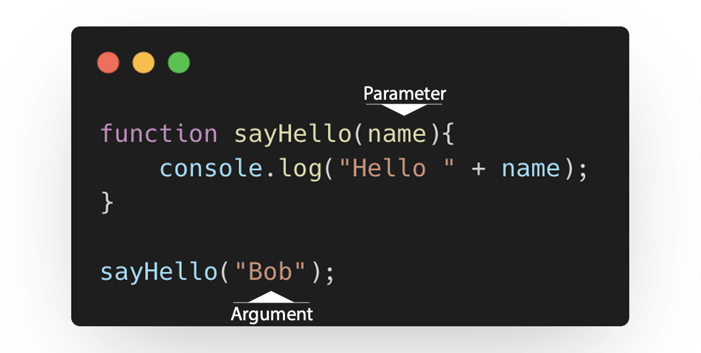

### **Créer une fonction**

Pour déclarer une fonction, on va utiliser le mot clé function suivi du nom de la fonction.

```javascript
function helloWorld() {
  console.log("Hello,");
  console.log("World!");
}
```

Pour appeler (exécuter/invoquer) la fonction, il faut simplement écrire son nom suivi par des parenthèses :

```javascript
helloWorld();
```

### **Paramétres/Arguments d'une fonction**



Dans cet exemple, on a créé une fonction nommée sayHello qui accepte une donnée nommée name en paramètre.

Ce paramètre sera substitué par l'argument donné entre les parenthèses de la fonction lors de son appel.
Lors de l'appel de la fonction, la donné qui est fournie à la fonction est appelée un argument.

Tu es libre de donner le nom que tu souhaites au paramètre : on l'a appelé name, mais on aurait pu donner le nom firstName à la place (ou quelque chose d'autre).

### **La concaténation**

Le fait d'accoler plusieurs chaînes les unes à la suite des autres

```javascript
console.log("Hello" + "I'm" + "Bob");
```

### **L'interpolation de chaînes**

Pour assembler des chaines ensemble, il y a une autre méthode un peu plus récente : l'interpolation.

Il suffit d'écrire la chaîne avec des "backticks" (``) à la place des guillemets

Dès que l'on souhaite insérer une expression (par
exemple une variable) dans la chaîne, on va utiliser le signe dollar ($) suivi d'accolades ({}) à l'intérieur desquelles on va pouvoir placer notre expression.

```javascript
const name = "Donald Duck";
console.log(`Hello, I'm ${name}`);
```

### **Return**

une fonction peut également produire une sortie qu'on appelle valeur de retour.

```javascript
function sum(a, b) {
  return a + b;
}
console.log(sum(1, 2));
```

_L'utilisation du mot-clé "return" stoppe immédiatement l'exécution de la fonction pour revenir au code appelant. Les lignes de code après un "return" ne seront donc jamais prises en compte._

exemple:

```javascript
function login(name, password) {
  if (name === "Bob" && password === "secret") {
    return true;
  } else {
    return false;
  }
}

let userName = prompt("What's your name?");
let userPassword = prompt("What's your password?");

if (login(userName, userPassword)) {
  console.log("Welcome!");
} else {
  console.log("Wrong credentials...");
}
```

### **Portée (scope) / Contexte**

En Javascript, dès que l'on écrit du code, le contexte est très important : on ne peut pas utiliser une variable déclarée à l'intérieur d'une fonction en dehors de cette dernière.

```javascript
function sayMyName() {
  let name = "Pierre";
  console.log(name);
  /// fonctionne bien dans le contexte de la fonction
}

function sayMyFullName() {
  let lastName = "Gerard";
  console.log(lastName + " " + name);
  // ne fonctionne pas
}
```
