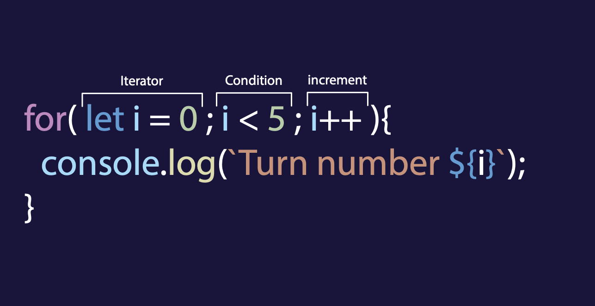

# **Boucles**

## **quésaco les boucles**

Une boucle est un moyen d'exécuter le même code plusieurs fois jusqu'à ce qu'une certaine condition soit remplie.

Exemple d'un boucle:

```javascript
for (let i = 0; i < 5; i++) {
  console.log("Turn number " + i);
}

/*
Turn number 0
Turn number 1
Turn number 2
Turn number 3
Turn number 4
*/
```

## **Différents types de boucles**

### **La boucle 'for'**



La déclaration _for_ nécessite 3 paramètres pour fonctionner:

- Le premier est une variable appelée itérateur, que nous devons créer et fixer à une valeur (ici nous voulons partir de zéro). Cette variable sera notre "compteur".

_Par convention, nous appelons souvent cette "variable i " (signifie itérateur ou index)_

- La seconde est la condition que nous voulons atteindre avant d'arrêter la boucle.

- la troisième est l'incrément. L'incrément sera exécuté à la fin de chaque boucle et, généralement, nous ajoutons un à l'itérateur.

_dans lexemple la boucle partira de 0, et vérifiera à chaque tour si "i" est inférieur à 5.
Si Oui ⇒ Elle exécutera le code et augmentera la valeur de un. Et ensuite, on recommence
Si Non ⇒ la boucle s'arrêtera_

```javascript
for (let i = 0; i < 5; i++) {
  console.log("Turn number " + i);
}
```

### **Parcourir un tableau**

Il est possible d'utiliser une boucle pour parcourir un tableau.

```javascript
const fruits = ["Apple", "Peach", "Banana"];

for (let i = 0; i < fruits.length; i++) {
  console.log(fruits[i]);
}
```

nous avons un tableau qui contient 3 éléments.

Nous créons une boucle for, qui ira de 0 à fruits.length (soit 2).

Au premier tour, elle affichera fruits[0], puis fruits[1] et enfin fruits[2].

### **Les boucles While et Do...while**

#### **While**

```javascript
let i = 0;

while (i < 5) {
  console.log(`turn number ${i}`);
  i++;
}
```

#### **Do...While**

do...while est similaire à while mais l'action est exécutée avant de vérifier la condition.

### **Portée (scope) / Contexte**

En Javascript, dès que l'on écrit du code, le contexte est très important : on ne peut pas utiliser une variable déclarée à l'intérieur d'une boucle en dehors de cette dernière.

Les accolades { } définissent un contexte local.

```javascript
    let sum = 0;

    for (let i = 0; i < 10; i++) {
       const name = "Pierre";
       console.log(name + " saw " + sum + " StarWars movies." );
       sum++;
       /// fonctionne correctement dans le contexte de la boucle
    }

    console.log(sum);
    /// tu verras la valeur de sum

    console.log(name);
    /// tu verras une erreur 'reference error: name is not defined'
    }

```
