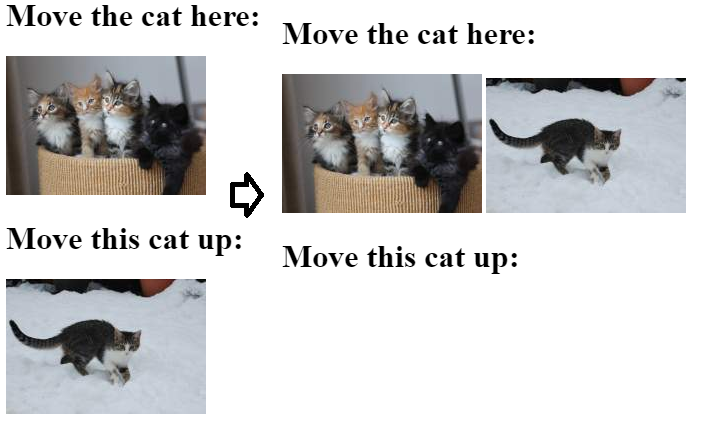
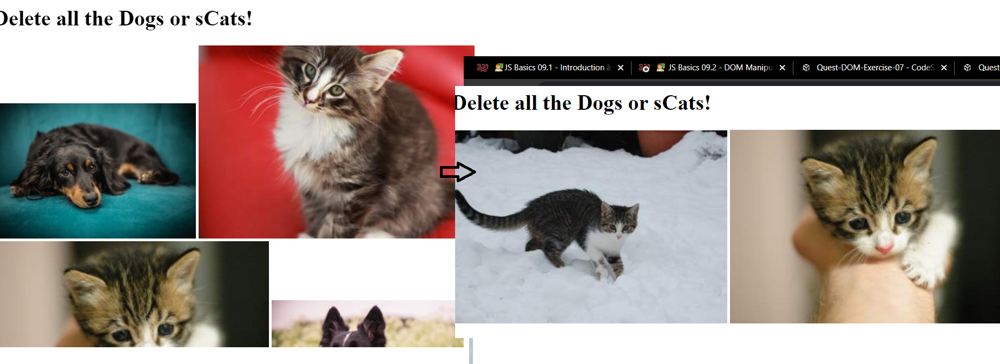
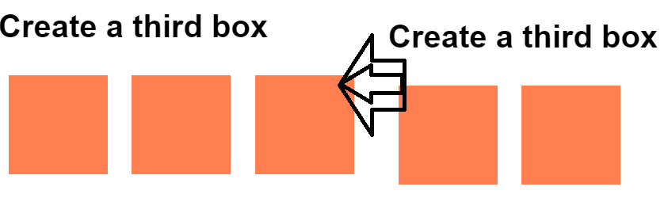

# **Créer un nouvel élément HTML**

Pour créer un élément, utilise la méthode createElement :

```javascript
const newCatImage = document.createElement("img");
```

Dans ce cas, parce que nous voulons créer une image, nous devons donner une source à cette nouvelle image:

```javascript
newCatImage.src = "https://placekitten.com/408/287";
```

Enfin, pour l'ajouter au DOM, nous pouvons utiliser la méthode appendChild.
La méthode appendChild va ajouter l'élément passé à la fin de l'élément sur lequel tu utilises la méthode.

Dans cet exemple, ceci ajoutera newCatImage à la fin de document.body:

```javascript
document.body.appendChild(newCatImage);
```

Cette méthode est également disponible sur d'autres noeuds HTML, par exemple, tu peux l'utiliser pour ajouter un élément à une <div>.

```javascript
const myDiv = document.querySelector(".myDiv");
myDiv.appendChild(myElement);
```

### **Changer la position d'un Élément du DOM**

Pour changer la position d'un élément, utilise appendChild.
Passe l'élément que tu veux déplacer comme paramètre; cela ne créera pas de copie mais déplacera l'élément.

```javascript
newDiv.appendChild(newCatImage);
```

ex :

```html
  </head>

  <body>
    <div id="app"></div>
    <div id="first-div">
      <h1>Move the cat here:</h1>
      
    </div>
    <div id="second-div">
      <h1>Move this cat up:</h1>
      
    </div>
    <script src="src/index.js"></script>
  </body>
```

```javascript
const catImage = document.querySelector("#second-cat-img");

const newDiv = document.querySelector("#first-div");

newDiv.appendChild(catImage);
```

_attention pour ID cest # pour classe cest ._



### **Supprimer un Élément du DOM**

Tu peux supprimer un élément du DOM en utilisant la propriété remove.

```javascript
myElement.remove();
```

**exemple**

```html
  <body>
    <h1>Delete all the Dogs or sCats!</h1>
    
    
    
    
    
    
    
    <script src="src/index.js"></script>
  </body>
</html>
```

on veut cxl les chiens, on utilise JS

```javascript
const dog = document.querySelectorAll(".img-dog");

for (let i = 0; i < dog.length; i++) {
  dog[i].remove();
}
```

ça nous donne



### **changer le style d'un élément HTML**

l est également possible de changer le style d'un élément HTML en utilisant la propriété style.
Le nom de la propriété doit être écrit en utilisant le camel case (nous ne pouvons pas utiliser de - lors du nommage en Javascript).

```javascript
someDiv.style.backgroundColor = "lightblue";
someText.style.fontSize = "20px";
```

exemple:

```html
<head>
  <title>Parcel Sandbox</title>
  <meta charset="UTF-8" />
  <link rel="stylesheet" href="./src/styles.css" />
</head>

<body>
  <h1 class="title">Change the text!</h1>
  <div class="box">Change the box!</div>

  <script src="src/index.js"></script>
</body>
```

```css
body {
  font-family: sans-serif;
}
.box {
  text-align: center;
  display: flex;
  align-items: center;
  justify-content: center;
  width: 100px;
  height: 100px;
  background-color: peru;
  color: white;
}
```

```javascript
// We create two variable for both title and box DOM element
const title = document.querySelector(".title");
const box = document.querySelector(".box");

// We change the style of the elements
title.style.color = "lightBlue";
title.style.fontSize = "60px";
title.style.textAlign = "center";
box.style.backgroundColor = "yellow";
box.style.height = "300px";
box.style.width = "400px";
```

On est obliger de le faire pour chaque
il y a un trick mais pas encore connu au bataillon

### **Ajouter/Supprimer une classe à un élément**

```javascript
element.classList.add("myClass");
element.classList.remove("myClass");
```

Note que, dans ce cas, comme la nature de l'élément est spécifiée (classList), nous n'avons pas besoin d'utiliser le . avant le nom de la classe.

exemple:

Dans cette page, il y a déjà quelques petites boîtes, et elles ont une classe CSS spécifique box. Crée une nouvelle boîte avec createElement, ajoute à cet élément la classe box, puis ajoute-la à la div container-boxes.

```html
<body>
  <div class="container-boxes">
    <h1>Create a third box</h1>
    <div class="box"></div>
    <div class="box"></div>
  </div>

  <script src="src/index.js"></script>
</body>
```

```css
.box {
display: inline-block;
height: 100px;
width: 100px;
margin: 10px;
background-color: coral;
```

```javascript
const newBox = document.createElement("div");
const myDiv = document.querySelector(".container-boxes");
myDiv.appendChild(newBox);
newBox.classList.add("box");
```


