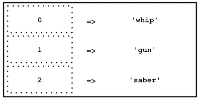

# **Les tableaux**

Voici la syntaxe pour creer un tableau:

```PHP
$weapons = ['whip', 'gun', 'saber'];
```

Il est aussi possible de déclarer un tableau de la manière suivante :
$weapons = array('whip', 'gun', 'saber');
Cette méthode n'est cependant presque plus utilisée depuis PHP 5.4

Le nom des tableaux est aux pluriels car il contient plusieur valeur.

Un Tableau peut contenir tout type d'élément
exemenple :

```PHP
$elements = [1, 'deux', true, [], 1.8];
```

## **Les tableaux indexé numériquement**

Un tableau a un index numérique qui se met en place automatiquement. le premier élement d'un tableau correspond a l'index 0 puis 1 puis 2 etc.

```php
$weapons = ['whip', 'gun', 'saber'];
echo $weapons[0]; // affiche : whip
echo $weapons[1]; // affiche : gun
echo $weapons[2]; // affiche : sabe
```



## **Ajouter des éléments a un tableau**

Un tableau a un nombre illimité de valeurs.
On peut en ajouter au fur et a mesure:

```php
$weapons = ['whip', 'gun', 'saber'];
$weapons[] = 'nuclear';
var_dump($weapons);
/*
  var_dump affichera :
  array(4) {
    [0] => string(4) "whip"
    [1] => string(3) "gun"
    [2] => string(5) "saber"
    [3] => string(7) "nuclear"
  }
*/
```

- var_dump()
  affiche les infos détaillé d'une variable. (utilisé pour déboguer)
  nuclear est rajouté a la fin

## **Le tableau associatif**

On a vu que les tableau s'index automatiquement numériquement. On pourrait l'écrire ainsi.

```php
$weapons[0] = 'whip';
$weapons[1] = 'gun';
$weapons[2] = 'saber';
```

cette déclaration est identique a

```php
$weapons = ['whip', 'gun', 'saber'];
```

Il est préférable d'indiquer nous meme les index (ou indice), on peut y mettre des **string** on parle alors de **key** (clef). Permet de donner du sens au valeur .

exemple

```php
$weapons['weapon_one'] = 'whip';
$weapons['weapon_two'] = 'gun';
$weapons['weapon_three'] = 'saber';
```

ou encore

```php
$weapons = [
  'weapon_one' => 'whip',
  'weapon_two'=>'gun',
  'weapon_three'=>'saber'
];
```

Pour les afficher

```php
echo $weapons['weapon_one']; // affiche : whip
echo $weapons['weapon_two']; // affiche : gun
echo $weapons['weapon_three']; // affiche : saber
```

Si j'assigne une valeur a une key qui en a deja une cela va la remplacer

```php
$weapons['weapon_one'] = 'dagger';
```

## **fonctions utiles pour les tableaux**

- count()
  Compte le nombre d'élément d'un tableau

```php
  $weapons = ['whip', 'gun', 'saber'];
  echo count($weapons); // affiche 3
```

- sort()
  permet de trier un tableau par ordre croissant de valeur

```php
$array = [2, 4, 1, 0, 8, 5];
  sort($array);
  var_dump($array);
  /*
    affiche:
    array(6) {
      [0] => int(0)
      [1] => int(1)
      [2] => int(2)
      [3] => int(4)
      [4] => int(5)
      [5] => int(8)
    }
  */

```

Fonctionne aussi avec un tableau de string

```php
  $weapons = ['whip', 'gun', 'saber'];
  sort($weapons);
  var_dump($weapons);
  /*
    affiche:
    array(3) {
      [0] => string(3) "gun"
      [1] => string(5) "saber"
      [2] => string(4) "whip"
    }
  */
```

La fonction sort() ne sert qu'à trier des tableaux numériques. Si tu l'utilises sur un tableau associatif tu perds l'association clé => valeur.
Note: Cette fonction assigne de nouvelles clés pour les éléments du paramètre array. Elle
effacera toutes les clés existantes que vous aviez pu assigner, plutôt que de les trier.

- asort()
  tris des valeur en gardant key intact

- ksort()
  tri les key en les gardant intact.

A noter que pour toute les fonction de tri on peut le faire de maniere ascendante ou descendante.
Contrairement à la plupart des fonctions php, tu ne peux pas faire :
$sortedWeapons = sort($weapons);
En effet, l'utilisation de sort() (comme toute autre fonction de tri) modifie directement le tableau passé en paramètre et retourne TRUE ou FALSE selon si le tri a fonctionné ou non
Toutes ces fonctions de tri travaillent sur le tableau lui-même, contrairement à la pratique normale qui serait de retourner le tableau trié.

- in_array()
  permet de vérifier la présence d'une valeur dans un tableau

```php
 $weapons = ['whip', 'gun', 'saber'];
  var_dump(in_array('whip', $weapons)); // affiche true
  var_dump(in_array('shield', $weapons)); // affiche false
```

Utile pour sctructure conditionnelle:

```php
if (in_array('shield', $weapons)) {
  echo "La valeur 'shield' est déjà présente dans le tableau";
} else {
  $weapons[] = 'shield';
  echo "La valeur 'shield' a été ajoutée au tableau weapons. Tu peux donc l'afficher de cette façon: $weapons[3]";
}
```

- array_sum()
  calcul la somme des valeurs d'un tableau

```php
  $values = [1, 2, 3, 4, 5];
  echo array_sum($values); // affiche 15
```

Fonction sur tableau
http://php.net/manual/fr/ref.array.php
http://www.progmatique.fr/article-33-Php-fonctions-manipuler-tableaux.html

## **Les boucles for**

```php
// Exemple concret d'une boucle allant de 0 à 9 avec un pas de 1
for ($i = 0; $i < 10; $i = $i+1) {
    // Do something
}

// Mais j'aurais pu l'écrire comme cela
for ($counter = 0; $counter < 10; $counter++) {
    // Do something
}

// Et si j'avais voulu aller de 9 à 0
for ($i = 9; $i >= 0; $i--) {
    // Do something
}

// Parcourir un tableau indexé numériquement :
$weapons = ['whip', 'gun', 'saber'];
for ($i = 0; $i < count($weapons); $i++) {
  echo $weapons[$i];  // affiche chaque valeur du tableau tour après tour
}
```

http://php.net/manual/fr/control-structures.for.php

## **Boucle while**

```php
// Exemple de boucle while
$i = 0;
while ($i < 10) {
    // Do something
    $i++;
}

// Exemple de boucle infinie (À NE PAS FAIRE !!!)
$firstname = 'Henry';
while ($firstname != 'Indy') {
    $firstname = 'Indiana';
    // Do something...
}
```

Le premier exemple est simple, on boucle tant que $i est strictement inférieur à 10.
Le second est une boucle infinie. Étant donné que le while boucle tant que la condition est true, il faut bien veiller à ce que l'expression du while devienne false.

http://php.net/manual/fr/control-structures.while.php

## **boucle foreach**

permet de boucler sur les tableaux

```php
$movies = [
  "Les Aventuriers de l'arche perdue",
  "Indiana Jones et le Temple maudit",
  "Indiana Jones et la Dernière Croisade",
  "Indiana Jones et le Royaume du crâne de cristal",
  "Indiana Jones 5"
];

// Si tu n'as pas besoin des clés du tableau
foreach ($movies as $movie){
    // Do something...
    echo $movie;
    // Affiche "Les Aventuriers de l'arche perdue"
    // (au 1er tour, puis les autres valeurs aux tours suivants)
}

// Si tu as besoin des clés du tableau
foreach ($movies as $key => $movie){
    // Do something...
    echo $key;      // Affiche 0 (au 1er tour)
    echo $movie;    // Affiche "Les Aventuriers de l'arche perdue" (au 1er tour)
}
```

C'est a moi de choisir le nom des variables $key et $movie
L'élément en cours de lecture, ainsi que sa clé selon la notation du foreach (avec ou sans le =>), vont être affectés à des variables temporaires ($key, $movie). Récupérer la clé est surtout utile en présence d'un tableau associatif.

http://php.net/manual/fr/control-structures.foreach.php

## **attention**

Boucles infinies
Attention: Si la condition d'arrêt d'une boucle est mal définie, cela peut être critique. En effet, la boucle sera infinie et plantera ton programme.
En PHP, si tu n'as pas modifié la configuration de base, les scripts ont une durée de vie de 30 secondes, donc ton navigateur (voire tout ton poste) peut ne pas répondre pendant maximum 30 secondes (il s'agit du paramètre max_execution_time dans ton fichier php.ini). Mais sur des langages de plus bas niveau, cela peut avoir des conséquences plus graves.
